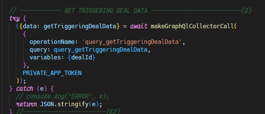
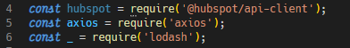
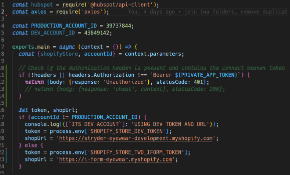

# Welcome to HubSpot Serverless template created by UnlimitedTechSolutions

Hello and welcome to the guidelines and best practicies to developing a new HubSpot project!  

These guideliness make code more readable, allow for better async dev work and will help development be more streamlined.

## Local Folder Structure

These guidelines advice that localy, work for every client should live under UTS root folder, and every project for that client should be a separate subfolder.  
But moreover every subfolder must be independently versioned, meaning that each subfolder is a repository in itself.  

📦UTS  
 ┣ 📂unlimited  
 ┃ ┣ 📂unlimited-serverless-demoProject  
 ┃ ┣ 📂[unlimited-serverless-template](https://github.com/unlimited-tech-solutions/unlimited-serverless-template)  
 ┃ ┗ 📂unlimited-workflows  
 ┣ 📂rebeccaBlack  
 ┃ ┣ 📂rebeccaBlack-serverless-friday  
 ┃ ┗ 📂rebeccaBlack-workflows  
 ┗ 📂zelda  
 ┃ ┣ 📂zelda-karana-majorasMask  
 ┃ ┣ 📂zelda-serverless-breathOfTheWild  
 ┃ ┗ 📂zelda-serverless-linksAwakening  

## UTS Style Guide

1. Use const at top of file w/ screaming snake case (e.g. HUBSPOT_ACCOUNT_ID=123123123)
2. Use prettier extension with provided .prettierrc file
3. Never use fetch or hubspot client, always axios (example functions provided in src\app\UTSHelpers\functions\..)
4. Avoid callback hell, never use ❌.then, ✔️ async ✔️ await all day
5. Try/catch for error handling (goes along with previous)\
   
6. require over import\
   
7. No hardcoded secrets → use .env file, and invoke when needed via E.g. process.env.PRIVATE_APP_ACCESS_TOKEN
8. Code needs to run in production and in sandbox without changing anything, use logic to load proper tokens as for HubSpot so for external platforms\
   
9. Include comments in code, explain sections as necessary

## Creating a new serverless project - HowTo

### Overview

One should create a new repository for each project, as already established.  

Start by creating new repository by the naming convention provided below,  
> Note: All github repositories should follow this structure  

\<clientName\>-\<projectType\>-\<projectName\>  

where projectType is oneOf:

1. workflows
1. karana
1. serverless

Replace `<clientName>-<projectType>-<projectName>` with the actual project naming convention as per your requirement.

### Steps to  (PowerShell)

To automate the process of cloning a GitHub this repository, renaming it, setting a new remote URL, and pushing to the new remote, follow these steps (you can copy paste this whole code block into powershell, and you will need one extra "ENTER" after you confirm the repo name):

1. **Open PowerShell.**
1. **Navigate to the client folder**
1. **Copy → Paste everything in PowerShell:**
1. **You will be promted to enter the name of the newly created repo. You can copy paste from github for good measure. Confirm**

    ```powershell
    # Step 1: Enter the repository name
    $RepositoryName = Read-Host "Enter the repository name"

    # Step 2: Confirm the name
    $response = Read-Host "Confirm the new name: '$RepositoryName'. Proceed? (Yes|yes|y / No)"

    if ($response -notmatch "^(Yes|yes|y)$") {
        Write-Host "Aborting the git clone"
    } else {
        # Step 3: Clone the repository
        git clone https://github.com/unlimited-tech-solutions/unlimited-serverless-template.git

        # Step 4: Rename the cloned directory into new repository name
        Rename-Item "unlimited-serverless-template" $RepositoryName

        # Step 5: CD into folder
        cd ".\$RepositoryName\"

        # Step 6: Set the new remote URL
        git remote set-url origin "https://github.com/unlimited-tech-solutions/$RepositoryName.git"

        # Step 7: Rename README.md to UTSGuideliness.md
        Rename-Item "README.md" "UTSGuidelines.md"

        # Step 8: Rename empty-readme-template.md to README.md
        Rename-Item "empty-readme-template.md" "README.md"

        # Step 9: Create .env file with the specified content
        $envContent = @"
    # The only reason you would use these separately and not loaded depending the sandbox or production
    # Is if you have access_token and refresh_token for some external platform stored in Integration record in production
    # So both DEV and PROD needs to fetch the data from the PROD Integration record
    PRIVATE_APP_ACCESS_TOKEN_PROD=pat-na1-xxxxxxxx-xxxx-xxxx-xxxx-xxxxxxxxxx
    PRIVATE_APP_ACCESS_TOKEN_DEV=pat-na1-xxxxxxxx-xxxx-xxxx-xxxx-xxxxxxxxxx

    # The token of either SANDBOX or PRODUCTION depending against what you are running `hs project dev` 
    PRIVATE_APP_ACCESS_TOKEN=pat-na1-xxxxxxxx-xxxx-xxxx-xxxx-xxxxxxxxxx
    "@

        Set-Content -Path ".env" -Value $envContent

        # Step 10: Stage all changes
        git add .

        # Step 11: Commit changes
        git commit -m "Initial commit"

        # Step 12: Push to the new remote
        git push origin
    }
    ```

## Serverless Project Strucutre

This project was spun up by running

```powershell
hs project create
```

but it has more than what HubSpot provides:

1. UTSHelper folder

## UTSHelpers folder

One can find many helpfull functions and common components in this folder\


📦src\
 ┗ 📂app\
 ┃ ┣ 📂app.functions\
 ┃ ┃ ┣ ...\
 ┃ ┣ 📂extensions\
 ┃ ┃ ┣ ...\
 ┃ ┣ 📂UTSHelpers  \
 ┃ ┃ ┗ 📂functions\
 ┃ ┃ ┃ ┗ 📂hubSpot\
 ┃ ┃ ┃ ┃ ┣ 📂graphQL\
 ┃ ┃ ┃ ┃ ┣ 📂v3\
 ┃ ┃ ┃ ┃ ┃ ┣ 📜patchRecord.js\
 ┃ ┃ ┃ ┃ ┃ ┗ ...
 ┃ ┃ ┃ ┃ ┗ 📂v4\
 ┃ ...

## Auto Deploy/Build into HubSpot Project

### Summary

Do work localy via `hs project dev` and push serverless with `hs project upload` when needed  
`git add .` and `git commit` localy to track progress, `git squash` if many commits before `git push origin`  
At the end of the day, push your work to github (Either main or dev), which will trigger auto build to HubSpot  

### Auto Bilds (GitHub → HubSpot)

1. main and dev are mandatory
1. deploying to main should auto build to hubspot production
1. deploying to dev should auto build to hubspot sandbox
1. merge or push to main is allowed
1. if multiple sandboxes name branch dev_sandboxName1 dev_sandboxName2
1. create feature branches as needed

Below is a diagram example of branche structure of a git.

```Mermaid
flowchart TD
    dev_c1-->fb_c1

    subgraph feature branch
    fb_c1[feature commit 1]-->fb_c2[feature commit 2]
    fb_c2-->fb_c3[feature commit 3]
    end

    
    main_initial-->dev_c1

    subgraph dev
    dev_c1[dev commit 1]-->dev_c2[dev commit 2]
    dev_c2-->dev_merge[merge into dev]
    fb_c3-->dev_merge
    dev_merge-->dev_c3[dev commit 3]
    end

    subgraph main
    main_initial[Initial commit]-->main_merge[merge into main]
    dev_c3-->main_merge
    end
```

### Git Commit Thought Process

1. Keep commit messages usefull and descriptive  
1. Use present tense ("add types to user" vs "added types to user") for you want to apply that commit to "add types to user" that feature not to "added types to user" that feature  
1. Let commit history tell a story, do as much commits as needed  
1. But, no one needs commits "add fix to navbar" "really add fix to navbar" "now fix is real", do a `git squash 3 -m "add fix to navbar"` to those before `git push origin`

```Mermaid
flowchart TD
    c1[hs project dev \n MAKE CHANGES LOCALY]-->c2[git add . \n git commit -m 'fix bug' \n hs project upload]
    c2-->c3{End for the day?}
    c3-- NO -->c1
    c3-- YES --> c4{Too many commits?}
    c4-- YES --> c5[git suqash N]
    c5 --> c6
    c4-- NO --> c6[git add . \n git commit -m 'fix bug' \n git push origin]

```

## Serverless Function/ Private App Gotchas:

- Folder Structure: private apps and serverless functions must match Hubspot's desired structure or otherwise won't build
- app.functions dir in src\app dir requires '.'
- app.json, crm-card.json, serverless.json and hsproject.json are all required

- With Webhooks: payloads with multiple headers are filtered strangely through Hubspot in Serverless Functions
- Headers that appear in Postman are sometimes not accessible in Hubspot CRM and require workaround to recieve properly

- Depending on the API, errors may need to be manually thrown after a catch block recieves them

- Sometimes routes in the Hubspot API documentation/ examples are wrong and won't work if you copy/paste

- Outputfields in Automated Workflows will stringify numbers and properties 

- Properties from webhook payloads on workflow webhook event triggers are not directly accessible to custom code blocks:
  - properties can be made accessible with the format data workflow block (same page as custom code block)
  - properties can also be set to a record and retrieved via that record

## HubSpot Getting Started Project Template

This is the Getting Started project for HubSpot developer projects. It contains a private app, a CRM card written in React, and a serverless function that the CRM card is able to interact with. This code is intended to help developers get up and running with developer projects quickly and easily.

## Requirements

There are a few things that must be set up before you can make use of this getting started project.

- You must have an active HubSpot account.
- You must have the [HubSpot CLI](https://www.npmjs.com/package/@hubspot/cli) installed and set up.
- You must have access to developer projects (developer projects are currently [in public beta under "CRM Development Tools"](https://app.hubspot.com/l/whats-new/betas)).

## Usage

The HubSpot CLI enables you to run this project locally so that you may test and iterate quickly. Getting started is simple, just run this HubSpot CLI command in your project directory and follow the prompts:

`hs project dev`

## Repo status

- Still under construction, open to feedback!
